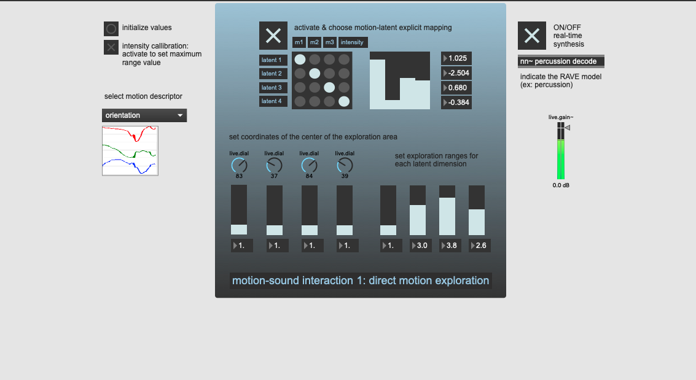
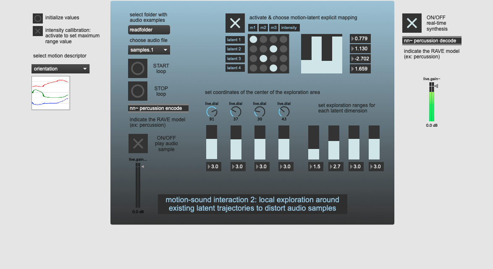
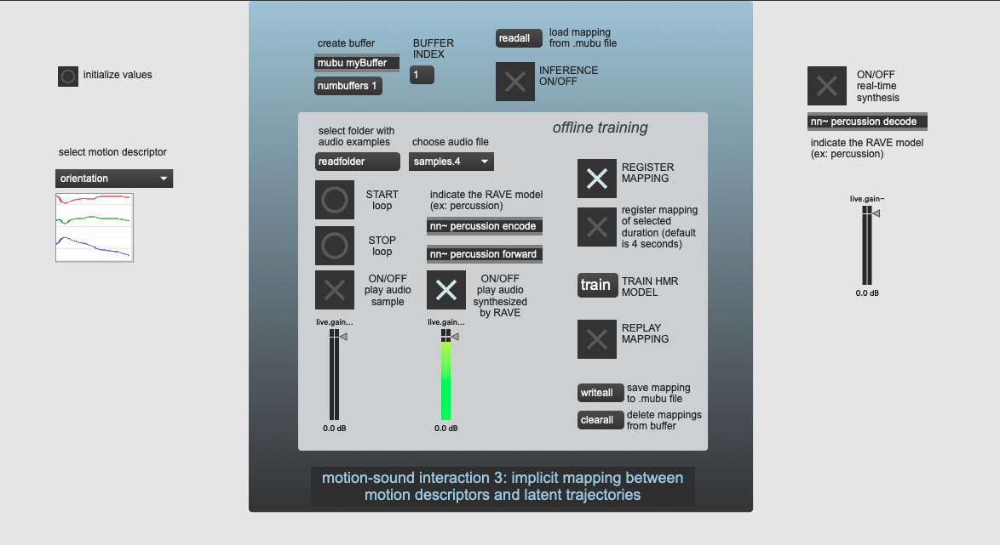
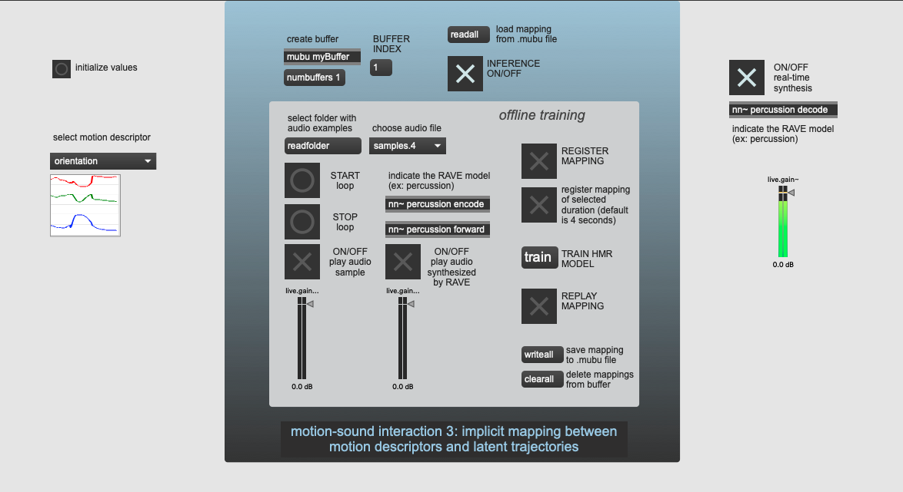

# Embodied exploration of deep latent spaces in interactive dance-music performance

*Sarah Nabi, Philippe Esling, Geoffroy Peeters and Frédéric Bevilacqua.*

*In collaboration with the dancer/choreographer Marie Bruand.*

This repository is linked to our [paper](https://hal.science/hal-04602229) presented at the 9th International Conference on Movement and Computing [MOCO'24](https://moco24.movementcomputing.org/). Please, visit our [GitHub page](https://ircam-ismm.github.io/embodied-latent-exploration/) for supplementary materials with examples.

In this work, we investigate the use of deep audio generative models in interactive dance/music performance. We introduce a motion-sound interactive system integrating deep audio generative model and propose three embodied interaction methods to explore deep audio latent spaces through movements. Please, refer to the paper for further details.


You can find the Max/MSP patches for the 3 proposed embodied interaction methods in the [`code/`](https://github.com/ircam-ismm/embodied-latent-exploration/tree/main/code) folder. We also provide tutorial videos in the [Usage](#usage) section.

NB: You can use the Max/MSP patches with other IMU sensors by replacing the `riotbitalino` object.


## Install and requirements

Our motion-sound interactive system implemented in Max/MSP. 

First, you need to install the required dependencies.

We used [R-IoT](https://ismm.ircam.fr/riot/) IMU motion sensors composed of accelerometers and gyroscopes with the [MuBu](https://ismm.ircam.fr/mubu/) library and the [Gestural toolkit](https://github.com/ircam-ismm/Gestural-Sound-Toolkit) for real-time motion capture and analysis. 

For deep audio generation, we relied on the [RAVE](https://github.com/acids-ircam/RAVE) model which enables fast and high-quality audio waveform synthesis in real-time on standard laptop CPU, and we used the [nn_tilde](https://github.com/acids-ircam/nn_tilde) external to import our pre-trained RAVE models in Max/MSP. 

You can download pre-trained RAVE models in [here](https://acids-ircam.github.io/rave_models_download).

## Usage 

### Interaction I1: direct motion exploration



**Tutorial video:**

[](https://www.youtube.com/watch?v=YEnCDyyMONs)

### Interaction I2: local exploration around existing latent trajectories



**Tutorial video:**

[](https://www.youtube.com/watch?v=Ys-JO3fACQ0)


### Interaction I3: implicit mapping between motion descriptors and latent trajectories

- First, do the *training phase*: synchronously record movement with sound to temporally-aligned both signals features and train the HMR model to capture the implicit movement-sound relationship.



- Second, do the *performance phase*: select the HMR model and activate the RAVE synthesis decoder for inference.



**Tutorial video:**

[](https://www.youtube.com/watch?v=SRlr5qbBy0E)


## Acknowledgments

This work has been supported by the Paris Ile-de-France Région in the framework of DIM AI4IDF, and by Nuit Blanche-Ville de Paris. We extend our heartfelt thanks to Marie Bruand without which this study would not have been possible. We are also deeply grateful to our friends and colleagues from the STMS-IRCAM lab, particularly Victor Paredes, Antoine Caillon and Victor Bigand.

## Citation
```
@inproceedings{nabi2024embodied,
  title={Embodied exploration of deep latent spaces in interactive dance-music performance},
  author={Nabi, Sarah and Esling, Philippe and Peeters, Geoffroy and Bevilacqua, Fr{\'e}d{\'e}ric},
  booktitle={Proceedings of the 9th International Conference on Movement and Computing},
  pages={1--8},
  year={2024}
}
```