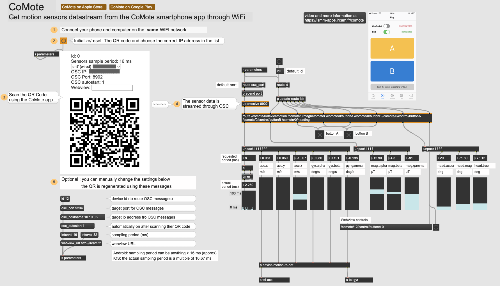

# Embodied exploration of deep latent spaces using smartphone's IMU motion sensors using CoMote

Here, we propose new MaxMSP patches to use the 3 embodied interactions strategies introduced in our paper with smartphone's IMU motion sensors instead of R-IoTs sensors initially used. To do so, we rely on the [**CoMote**](https://github.com/ircam-ismm/comote.git) package developed by the [ISMM](https://ircam-ismm.github.io/) team at IRCAM.
We have cloned the [`comote-helpers` official github repository](https://github.com/ircam-ismm/comote-helpers.git) in this repository for this tutorial.

## Install CoMote

1. On your smartphone, go to the App store and download the **CoMote** application.

2. Then, open MaxMSP and in "`Options > File Preferences ...`" add the absolute path to `./embodied-latent-exploration/code/smartphones-imu-sensors/comote-helpers/max`directory.

3. Open the `CoMote_smartphone_imu_datastream.maxpat` patch in Max. Open the CoMote application on your smartphone and scan the QR code. 

**Important note:** ***Make sure that your smartphone and laptop are connected to the same WiFi network !***

You should see the following :

## Usage

The 3 embodied interactions adpated to work with smartphones can be found in the directory `./embodied-latent-exploration/code/smartphones-imu-sensors/` where we have the following 3 patches:
- `interaction1_direct_motion_exploration_comote.maxpat`
- `interaction2_local_exploration_distort_audio_samples_comote.maxpat`
- `interaction3_implicit_mapping_motion_latent_trajectory_comote.maxpat`

It is exactly the same usage as with the R-IoTs, we simply replaced the `riotbitalino` Max object to receive accelerometers and gyroscopes data from CoMote. Please, refer to the tutorial videos for more details.